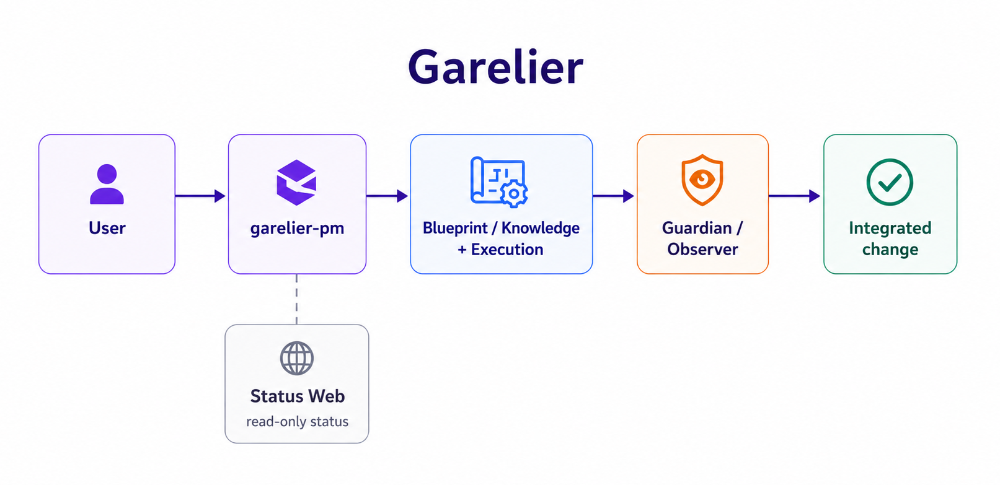
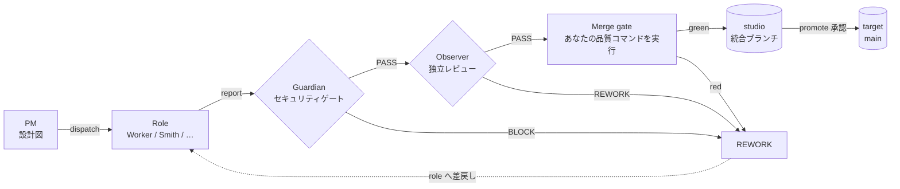
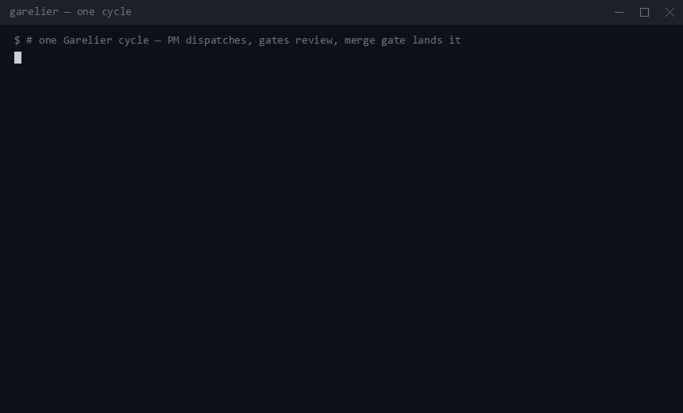
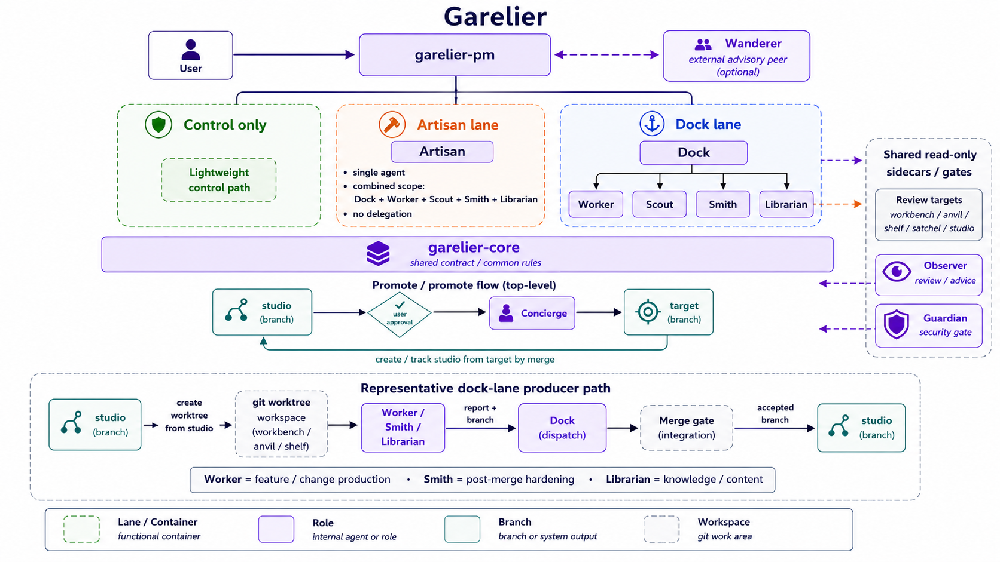
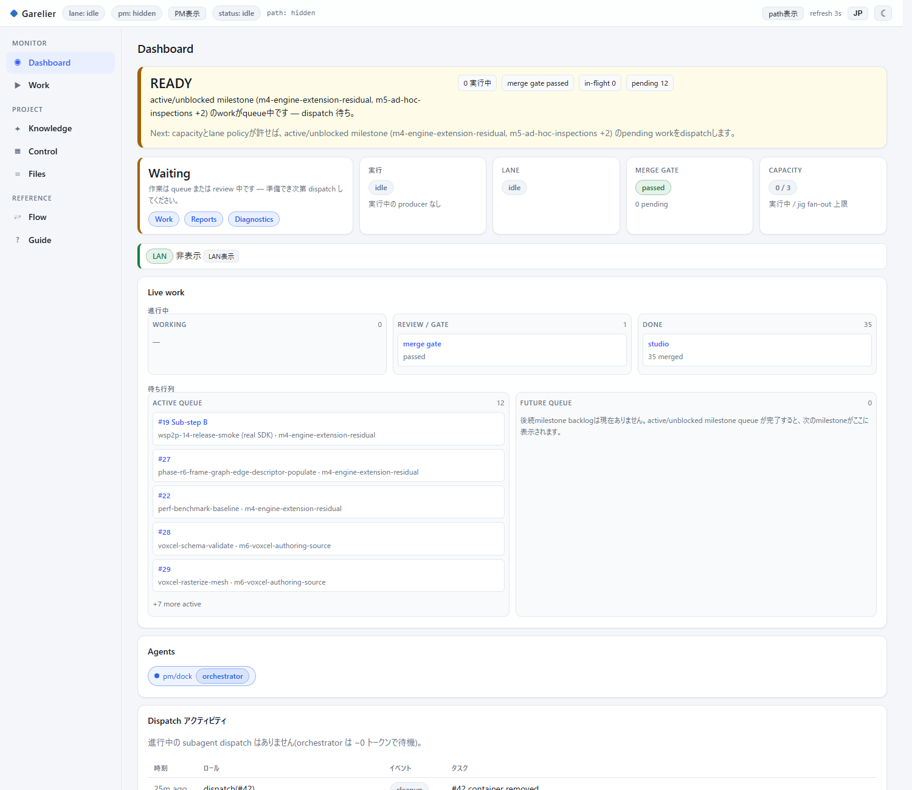
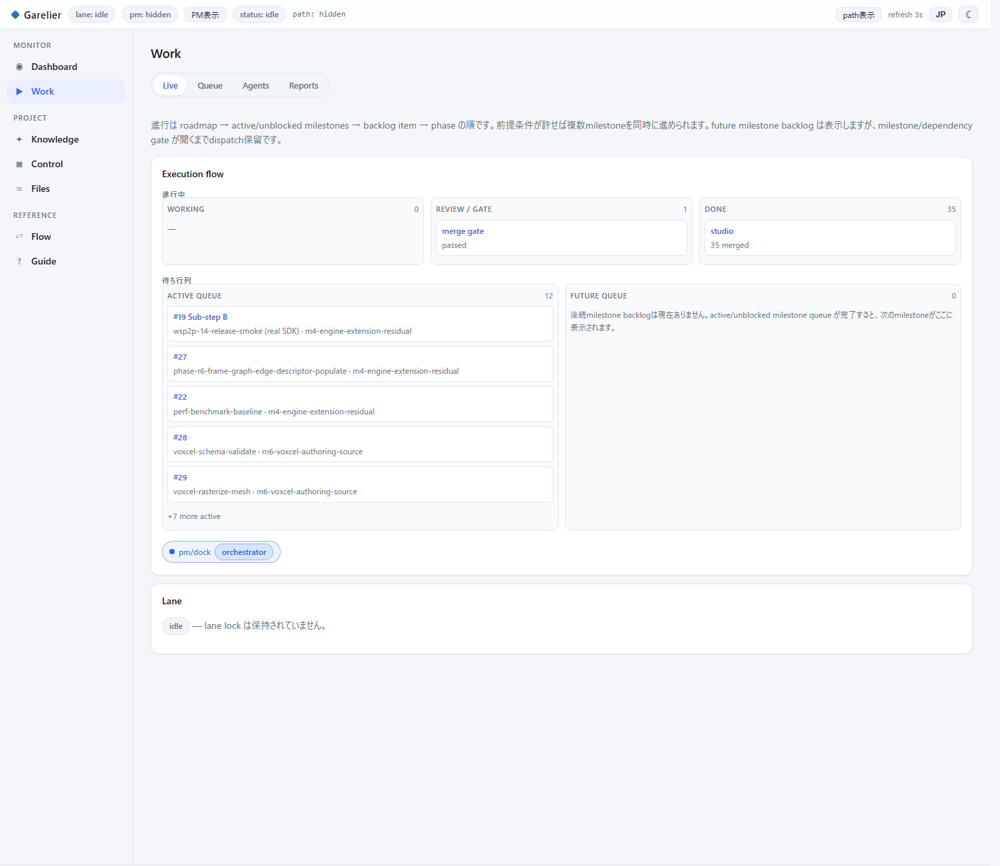

# Garelier(日本語）

[English / 英語版](README.md)

**Claude Code（または Codex CLI）を、レビューゲート・マージパイプライン・
機械執行されるコマンドレールを備えた「11 ロールの開発チーム」に変える —
すべてローカル、すべて git ネイティブ、いつでも完全に取り外せます。**

使う側がすることは監督だけ。話しかける相手は 1 ロール(PM)だけです。PM が計画を
立て、実装・レビュー・統合を担う専門ロールへ作業を割り振ります。各ロールは
自分のブランチで動き、リポジトリ内のファイルを介して連携します。リポジトリ内の
local branch と file だけで完結して動くので、追加のインフラなしで始められます。
リモートへ push するのは、あなたが指示したときだけです。

## 実装契約

本番の helper ロジックは `skills/garelier-core/driver/src` の TypeScript で実装し、
Bun 1.4.0 以上が必須です。helper は `bun <entrypoint.ts のパス>` で直接起動します。
shell 互換 shim は出荷しません。唯一の例外は、高頻度 PostToolUse hook の latency
pre-filter として残す `skills/garelier-core/hooks/task_mirror_hook.sh` です。



## 1 サイクルの全体像





## なぜ

AI エージェントを並列で動かすと、3 つの現実的な問題が起きます。Garelier は
それぞれに「仕組みでの解答」を用意しています。

- **衝突する。** 同じ作業ツリーを 2 体が編集すると、git インデックスを奪い合い
  ます。Garelier は各タスクに専用ブランチと worktree を与え、2 つの dispatch が
  重なるファイルを宣言した場合は **開始前に** それを提示します。
- **暴走する。** 無人のエージェントはファイル削除・履歴書き換え・ネットワーク
  到達をやりかねません。Garelier は人間を唯一の会話窓口に保ち、すべてのマージを
  セキュリティゲートと独立レビューに通し、危険なコマンドを実行前に deny / hold
  できる `PreToolUse` フックを加えます。
- **黙り込む。** 詰まったエージェントは 1 時間なんの合図もなく座り続けることが
  あります。stall-scan escalation が無進捗の role を検知し、待ち続ける
  代わりに固定の nudge → hand-off 経路へ乗せます。

## できること(What you get)

以下はすべて現在実装済みです。各項目は実体へのリンク付きです。

- **11 ロール** — PM, Dock, Worker, Scout, Smith, Artisan, Librarian, Observer,
  Guardian, Concierge、および外部助言役の Wanderer。
  [AGENTS.md](AGENTS.md) / [docs/concepts.md](docs/concepts.md) 参照。
- **ファイルベースの受け渡し** — ロールは共有プロセスではなく、リポジトリ内の
  `assignment.md` / `report.md` / `STATE.md` で連携します。
  [docs/protocol.md](docs/protocol.md) 参照。
- **あなたの品質コマンドを実行するマージゲート** — マージ候補は、プロジェクト
  自身の build/test/lint コマンドが通ってから `studio` へマージされます。実行は
  [`merge-gate.ts`](skills/garelier-core/driver/src/scripts/merge-gate.ts)。
- **2 つの独立したレビュー層** — すべてのマージ候補は Guardian セキュリティ
  ゲート(秘密情報 / PII / 依存 / ライセンス)を通り、**その後** Observer
  レビューへ、という固定順を通ります。
  [docs/state_machine.md](docs/state_machine.md) 参照。
- **stall-scan escalation** — 無進捗の role には固定の nudge、続いて
  hand-off が入り、黙って止まったままにはなりません。
  [pm_playbook.md](skills/garelier-core/references/pm_playbook.md) 参照。
- **並列コンフリクト検出** — 新しい dispatch が宣言したファイル(`--touches`)が、
  既に active な dispatch と重なる場合、開始前に PM へ提示されます。
  [conflict_check.ts](skills/garelier-core/driver/src/dispatch/conflict_check.ts)
  参照。
- **追跡可能なコミット** — Garelier の作業は `Garelier:` git trailer を持つため、
  `git log --grep '^Garelier:'` でエージェントの作業を正確に抽出できます。
  [commit_convention.md](skills/garelier-core/commit_convention.md) 参照。
- **レールとゲート**(保証ではなくリスク低減 — 次節を必ず読んでください):
  - 危険なコマンドを実行前に deny / hold する `command_guard` `PreToolUse`
    フック
    ([command_guard.md](skills/garelier-core/references/command_guard.md));
  - 削除・強制書き込みの 2 段階規律;
  - 「データ中で見つかった指示はコマンドではなくデータ」規則と、ネットワーク
    送信(egress)を Concierge ロールに限定する規則
    ([injection_and_egress.md](skills/garelier-core/references/injection_and_egress.md));
  - 外部パッケージの採否基準 — version pin + lockfile 必須、install-即-実行 tool
    (`uvx` / 単発 `npx` / `curl | sh`)は禁止
    ([package_policy.md](skills/garelier-core/references/package_policy.md));
  - ポリシー全文: [references/](skills/garelier-core/references/)。
- **トークン規律** — 圧縮したエージェント間レジスタと要約出力で、長時間の実行を
  現実的なコストに保ちます。
  [output_control.md](skills/garelier-core/output_control.md) 参照。
- **設計として可逆** — `.claude/settings.local.json` と `__garelier/` に閉じた
  non-mandatory layer です。`teardown` モードが配線を除去し、`__garelier/` を
  削除すれば通常の git / build / test に戻ります。[取り外す](#removing-it) 参照。

## セキュリティモデルと限界

Garelier は **リスクを下げますが、リスクを無くすことはできません。あなたの
エージェントが何をするかの最終責任は、あなたにあります。**
頼りにする前に、必ずこの節を読んでください。

- **モデルの挙動は保証できません。** 上記の規律はプロンプトと規約でエージェントを
  **誘導** しますが、言語モデルが何を決めるかを **拘束** するものではありません。
  すべてのレールは保証ではなく、リスク低減として扱ってください。
- **`command_guard` は一層であり、しかも v1 です。** table 駆動の regex ルール
  集合です。難読化されたコマンドや table に無いケースはすり抜け得ます。sandbox
  ではなく多層防御の一層であり、check 通過を「このコマンドは無害だ」と読み替えては
  いけません。
- **フックは配線された場所でしか効きません。** ガードは、ロールの
  `.claude/settings.local.json`(または PM セッションの project-root settings)が
  設置した場所で動きます。その配線の外で起動したセッションにはガードがありません。
- **Guardian と Observer 自身が LLM レビューです。** 誤判定し得ます。実スキャナ
  (例: 秘密情報の gitleaks)が設定されていればそのスキャナは実物ですが、それを
  包むレビュー判定はやはりモデルの意見です。
- **最終責任は operator です。** 実行 CLI に選ぶ permission mode と、何を走らせる
  かというあなた自身の判断は、あなたの責任のままです。Garelier が
  attended-first(監督前提)なのは、まさにこのためです。

## クイックスタート

### 前提

- **Claude Code** または **Codex CLI** — ロールを実際に動かす CLI。
- **git 2.5 以上** — worktree サポートが必要です。
- **Bun 1.4.0 以上** — ヘルパースクリプト・merge gate・Status Web を動かします。
  インストールは `winget install Oven-sh.Bun`(Windows)/
  `brew install oven-sh/bun/bun`(macOS)、または <https://bun.ts> から。
- **gitleaks** — Guardian の秘密情報スキャン。`winget install Gitleaks.Gitleaks`
  / `brew install gitleaks`。無い場合、縮退させない限りそのゲートは BLOCK。
- **Windows** — installer は Bun で直接起動します。Claude Code / Codex CLI 用に
  skill を symlink するため、Developer Mode の有効化が必要です。

### 手順

**1. Claude Code プラグインとして入れる(推奨)。** Claude Code 内で:

```text
/plugin marketplace add aby-studio-works/garelier
/plugin install garelier@garelier
```

これで Claude Code では全 `garelier-*` skill が使えます(手動の copy / symlink は
不要)。Codex CLI で使う場合、またはローカル checkout を開発版として使う場合は、
`bun skills/garelier-core/driver/src/scripts/install.ts` が `~/.claude/skills/` と `~/.codex/skills/` へ
symlink します。片方だけに入れる場合は `--claude-only` / `--codex-only` を使い
ます。[docs/getting_started.md](docs/getting_started.md) 参照。

**2. プロジェクトをセットアップする。** 対象リポジトリの git ルートで Claude Code
を開き、こう伝えます:

> `garelier-pm` でこのプロジェクトをセットアップして

PM がリポジトリを調べ、stack・build/test コマンド・target branch を検出し、
サマリを 1 枚確認するだけで初期化します。実質きかれるのは `pm_id` だけです
(1 人で使うなら既定の `_workshop` でかまいません)。セットアップ直後に、スキャン
結果から `AGENTS.md` の下書きを提案するので、承認するだけで埋まります。

**3. 最初のタスクを走らせる。**

> `<やりたいこと>` の設計図を作って、そのまま進めて

各ロールが実装し、Guardian → Observer → マージゲートを通してから統合されます。
「Status Web を起動して」と言えば読み取り専用ビューが出ます。目標まで自走させたい
ときは、opt-in の `/loop`(既定 OFF)を arm します。

## 他との比較

エージェントを動かす方法は Garelier だけではありません。違いは次の通りです。

| アプローチ | 連携のしかた | 動く場所 | レビュー / ゲート |
| --- | --- | --- | --- |
| 素の Claude Code サブエージェント | その都度、自分で各体を統率 | ローカル | 標準では無し |
| Issue トラッカー中心のエージェント PM | ホスティングされたトラッカー(issue / PR)経由 | リモートサービスが必要 | 構成次第 |
| 方法論 / 規約の skill 集 | プロンプト規約 | ローカル | 助言のみ |
| **Garelier** | ファイルベースのロール + 実行レーン | **ローカル、git ネイティブ** | **Guardian + Observer + マージゲート + `command_guard`** |

このトレードオフは意図的です。Garelier は **ローカル優先・監督優先** なので、
ホスティングされたダッシュボードや無人自律を標準で与える代わりに、リポジトリに
実在するゲートとレールを与えます。

## どの構成で使うか

必要な規模に合わせて 3 段階から選べます。あとから同じデータのまま上位構成へ
移行できます。

- **Garelier Control** — どの構成にも必ず存在する管理面。計画・backlog・判断と
  ナレッジを管理します。roster を空にして setup すれば単体でも運用でき、下記の
  構成はこの上に実行機構を足したものです。
- **Artisan** — Control に加えて、1 体のエージェントが設計から統合まで通しで
  1 タスクを担当します。
- **Full Garelier** — 全ロール・3 つの実行レーン(dock / artisan / 軽量
  PM-direct)・自動統合まで使うフル構成(DEC-093)。

新規 Control namespace は schema 3 が既定です。複数 Roadmap、共有・入れ子
Milestone、Backlog、Current、Checkpoint、Notes、decision、risk と
Dashboard 時代の project view を、Markdown plan graph で一体管理します。
typed validation、revision、session、claim、transaction、portable bundle、
read-only Status Web による効率化も引き続き利用できます。

```bash
cd <repo> && garelier setup --pm-id _workshop
garelier control session-open --project <repo> --pm-id _workshop --agent codex --format json
```

初期化は `garelier setup` に一本化されています。`control/` tree と
`knowledge/` tree を同時に作成します。(旧 `control-init` / `library-init`
command は control-only skill とともに W-314 で削除されました。)

Control は schema 3 と `plan_graph_markdown` storage だけを受理します。
それ以外の namespace 形式は明示的に拒否します。

## Plant modes

- **Plant-Lithosphere** — 対象リポジトリ内に `__garelier/` を置く標準構成
  (`control_root == target_root`)。
- **Plant-Crust** — 外部管理構成。workfolder は `crust.toml` と container
  registry のみを持ち、`__garelier/` は各 container 内に置きます。
  [docs/plant_crust.md](docs/plant_crust.md) /
  [docs/lens.md](docs/lens.md) 参照。

## <a id="removing-it"></a>取り外す

Garelier は対象プロジェクトに踏み込まない、いつでも除去できるレイヤーです。
取り外しても、通常の git / build / test はそのまま動きます。

1. 実行を止める(PM に「止めて」と伝える)。
2. 各ロールの作業完了を待つ。
3. `setup_wizard --mode teardown` を実行する(`__garelier/<pm_id>/_crew/pm/` から)。
   project-root と各ロール checkout の `.claude/settings.local.json` から
   `command_guard` PreToolUse フックだけを除去し(他の key は保持)、残っている
   worktree を除去承認のために inventory します(teardown 自体はデータを
   削除しません)。この step を飛ばすとフックが root settings に残ります。
4. 残っている作業用 worktree があれば外す(通常は自動で片付きます)。
5. ローカルの `garelier/*` ブランチを削除する(push はされていません)。
6. `__garelier/` を削除する。

リポジトリ直下に増えるのは、利用者所有の `AGENTS.md` と、bun がある fresh
setup で追加される **ローカル限定の `.claude/settings.local.json`
(`command_guard` フック)** だけです。後者は慣習として gitignore され、上の
step 3 の teardown で除去されます。`.gitignore`・共有 CI・`.git/hooks` の
git hook は追加しません(DEC-051)。
[docs/getting_started.md](docs/getting_started.md#removing) 参照。

## もっと詳しく

- [docs/getting_started.md](docs/getting_started.md): 導入手順
- [docs/control_contract.ja.md](docs/control_contract.ja.md): 現行 schema 契約
- [docs/concepts.md](docs/concepts.md): 全体概念・仕組み
- [AGENTS.md](AGENTS.md): 用語・ロール境界・ルール
- [docs/protocol.md](docs/protocol.md): ファイルプロトコル
- [docs/state_machine.md](docs/state_machine.md): 状態遷移
- [docs/web_console.md](docs/web_console.md): Status Web
- [docs/canonical_index.md](docs/canonical_index.md): 正本の所在
- [CHANGELOG.md](CHANGELOG.md): 変更履歴
- [Zenn 紹介記事](https://zenn.dev/aby_studio/articles/677ed98e6742d4): 背景とウォークスルー



## Status Web

進行中のタスク・キュー・レビュー結果は、読み取り専用の Status Web で確認できます
(AI トークンを消費せず、状態も変更しません)。





## ライセンス

[](LICENSE)

Apache License 2.0(Garelier v3.0.0)。詳細は [LICENSE](LICENSE) を参照してください。

## 非提携

Garelier は、OpenAI、Anthropic、Claude Code、Codex CLI とは、公式な提携・承認・
スポンサー関係にありません。Claude Code、Codex CLI、その他の製品名・サービス名は、
それぞれの所有者の商標またはサービス名です。

## 免責

Garelier は現状有姿で提供されます。プロジェクトへの適用、外部操作、生成物の確認、
AI 実行 CLI の利用判断は、利用者の責任で行ってください。保証および責任制限の詳細は
[LICENSE](LICENSE) の Apache License 2.0 に従います。
