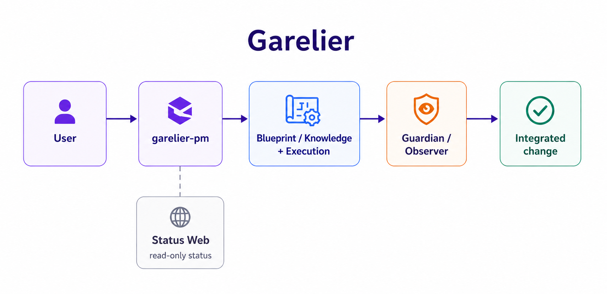
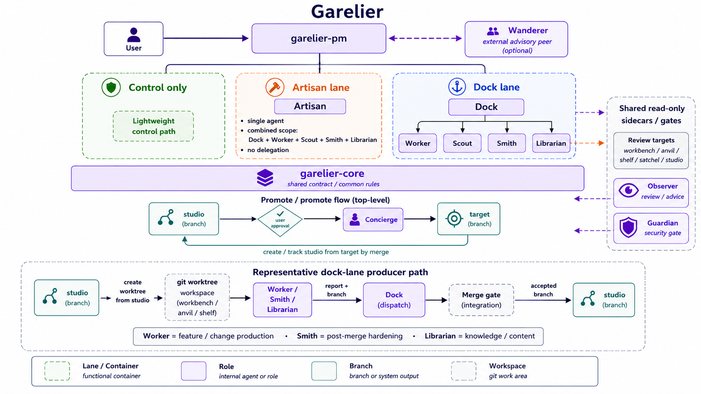
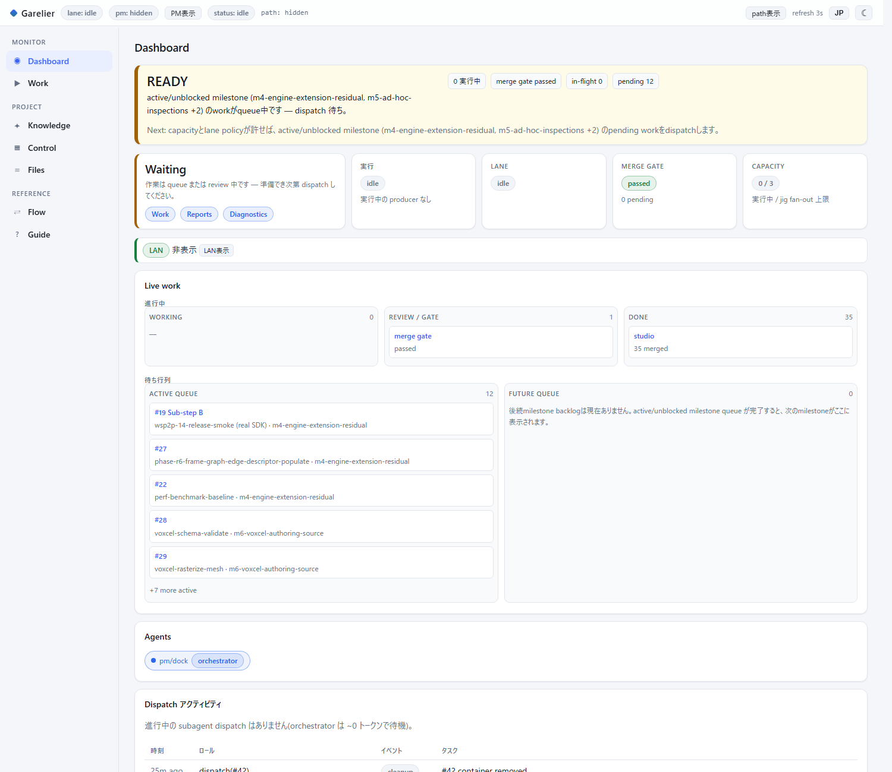
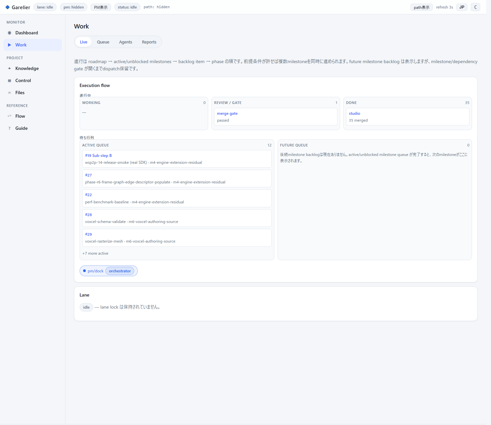

# Garelier

> **v2.8.4**

日本語 | [English](#english)

Garelier は、Claude Code / Codex CLI を「役割分担・ファイル受け渡し・ナレッジに
沿ったゲート」で束ね、長期プロジェクトの開発を整理しながら継続的に前へ進める、
人間監督下のマルチエージェント開発フレームワークです。

使う側がすることは、基本的に **`garelier-pm` に話しかけるだけ**です。設計図づくり・
実装・レビュー・統合といった工程は、PM が裏側で各ロールに割り振って進めます。
内部コマンドを覚える必要はありません。



## できること

- **会話だけで進む**: やりたいことを PM に伝えると、設計図 → 実装 → レビュー →
  統合まで一連の流れで進みます。
- **品質ゲートが自動で挟まる**: 秘密情報・PII・依存・ライセンスなどの確認(Guardian)と
  独立レビュー(Observer)を通してから統合します。
- **状態が一目でわかる**: 進行中のタスク・キュー・レビュー結果を、読み取り専用の
  Status Web で確認できます。
- **いつでも外せる**: 対象プロジェクトに踏み込まず、`__garelier/` を消すだけで元の
  git / build / test に戻せます。
- **個人開発から大規模まで**: 1 人でも、自分の規約や使うライブラリの仕様を
  覚えさせて使えます。

## 導入

### 1. プラグインとして入れる(推奨)

Claude Code で次を実行します。

```text
/plugin marketplace add aby-studio-works/garelier
/plugin install garelier@garelier
```

これで全 `garelier-*` skill が使えるようになります(手動の copy / symlink は不要)。
fork から使う場合は `<owner>/<repo>` を読み替えてください。手動配置や dev mode は
[docs/getting_started.md](docs/getting_started.md) を参照してください。

### 2. 動かすのに必要なもの

| ツール | 用途 | 備考 |
| --- | --- | --- |
| git 2.5 以上 | 前提 | 導入済みの想定 |
| 実行 CLI | ロールの実行 | Claude Code / Codex CLI |
| Bun 1.3.14 以上 | スクリプト・merge gate・Status Web | |
| gitleaks | Guardian の秘密情報チェック | 無い場合は該当ゲートが BLOCK(`secret_scan = "off"` で縮退可) |
| PowerShell | `.ps1` ヘルパー | Windows は同梱の 5.1+ で動作(7 推奨)。macOS / Linux で `.sh` を使うなら不要 |

インストール例:

```bash
# Windows (winget)
winget install Oven-sh.Bun
winget install Gitleaks.Gitleaks
winget install Microsoft.PowerShell   # PowerShell 7(推奨)

# macOS (Homebrew)
brew install oven-sh/bun/bun
brew install gitleaks
brew install --cask powershell        # .ps1 ヘルパーを使う場合のみ
```

Windows で symlink を使う場合は Developer Mode または管理者権限が必要です。

## 使い方

利用先プロジェクトの git ルートで Claude Code を開き、`garelier-pm` skill を
有効にして会話するだけです。

1. **セットアップ**: 「`garelier-pm` でこのプロジェクトをセットアップして」。
   PM がリポジトリを調べて stack・build/test コマンド・target branch を検出し、
   サマリを 1 枚確認するだけで初期化します(実質きかれるのは `pm_id` だけ。
   1 人で使うなら既定の `_workshop` でかまいません)。
2. **下準備の承認**: セットアップ直後は `AGENTS.md` に未確定の箇所が残りますが、
   PM がスキャン結果から下書きを出すので、承認するだけで埋まります。
3. **設計図づくり**: 「`<やりたいこと>` の設計図を作って」。PM が目的・範囲・
   受け入れ条件・確認方法・リスク・担当ロールを整理して保存します。
4. **実行**: 「その設計図で進めて」。各ロールが実装し、Guardian → Observer の
   確認を通して統合します。目標まで自動で進めたいときは `/loop` を使います。
5. **状態確認**: 「Status Web を起動して」。読み取り専用の URL を案内します。

ナレッジを足したいときは「`<コーディング規約や外部ドキュメント>` を扱えるように」と
頼めば、PM が担当ロールに回します(自分の規約・使うライブラリの仕様・プロジェクト
固有のルールなど、エージェントに参照させたい情報なら何でも)。詳しい手順は
[docs/getting_started.md](docs/getting_started.md) を参照してください。

## どの構成で使うか

必要な規模に合わせて 3 段階から選べます。あとから同じデータのまま上位の構成へ
移行できます。

- **Garelier Control**: ロールやブランチを使わない最小構成。計画・backlog・判断の
  管理と、ナレッジの管理だけを行います。まず軽く使い始めたいときに。
- **Artisan**: Control に加えて、1 体のエージェントが設計から統合まで通しで
  担当する構成。
- **Full Garelier**: 全ロール・2 つの実行レーン・自動統合まで使うフル構成。

## 取り外す

Garelier は対象プロジェクトに踏み込まない、いつでも除去できるレイヤーです。
取り外しても、通常の git / build / test はそのまま動きます。

1. 実行を止める(PM に「止めて」と伝える)。
2. 各ロールの作業完了を待つ。
3. 残っている作業用 worktree があれば外す(通常はタスク完了時に自動で片付きます)。
4. ローカルの `garelier/*` ブランチを削除する(push はされていません)。
5. `__garelier/` を削除する。

リポジトリ直下に増えるのは利用者所有の `AGENTS.md` だけで、`.gitignore`・共有 CI・
git hook などは追加しません。

## もっと詳しく

仕組みの細部(dispatch によるロール実行、2 つの実行レーン、ブランチ構成、ファイル
プロトコル、状態遷移など)はドキュメントにまとめています。



- [docs/getting_started.md](docs/getting_started.md): 導入手順
- [docs/concepts.md](docs/concepts.md): 全体概念・仕組み
- [AGENTS.md](AGENTS.md): 用語・ロール境界・ルール
- [docs/protocol.md](docs/protocol.md): ファイルプロトコル
- [docs/state_machine.md](docs/state_machine.md): 状態遷移
- [docs/web_console.md](docs/web_console.md): Status Web
- [docs/canonical_index.md](docs/canonical_index.md): 正本の所在
- [CHANGELOG.md](CHANGELOG.md): 変更履歴

## Status Web

進行中のタスク・キュー・レビュー結果は、読み取り専用の Status Web で確認できます。





## ライセンス

Apache License 2.0。詳細は [LICENSE](LICENSE) を参照してください。

## 非提携

Garelier は、OpenAI、Anthropic、Claude Code、Codex CLI とは、公式な提携・承認・
スポンサー関係にありません。Claude Code、Codex CLI、その他の製品名・サービス名は、
それぞれの所有者の商標またはサービス名です。

## 免責

Garelier は現状有姿で提供されます。プロジェクトへの適用、外部操作、生成物の確認、
AI 実行 CLI の利用判断は、利用者の責任で行ってください。保証および責任制限の詳細は
[LICENSE](LICENSE) の Apache License 2.0 に従います。

---
<a id="english"></a>

# Garelier — English

> **v2.8.4**

[日本語](#garelier) | English

Garelier is a human-supervised multi-agent development framework that drives
Claude Code / Codex CLI through role separation, file-based handoff, and
knowledge-grounded gates, keeping long-running projects organized while moving
them steadily forward.

As a user, you basically just **talk to `garelier-pm`**. Drafting the
blueprint, implementing, reviewing, and integrating all happen behind the
scenes, with the PM routing the work to each role. There are no internal
commands to memorize.


## What it does

- **Driven by conversation**: tell the PM what you want, and it flows from
  blueprint → implementation → review → integration.
- **Quality gates applied automatically**: changes pass a secrets / PII /
  dependency / license check (Guardian) and an independent review (Observer)
  before they are integrated.
- **Status at a glance**: watch in-flight tasks, the queue, and review results
  on a read-only Status Web.
- **Removable any time**: it does not intrude on your project — deleting
  `__garelier/` returns you to plain git / build / test.
- **From solo to large scale**: even solo, you can teach it your own
  conventions and the specs of the libraries you use.

## Install

### 1. As a plugin (recommended)

In Claude Code, run:

```text
/plugin marketplace add aby-studio-works/garelier
/plugin install garelier@garelier
```

This makes every `garelier-*` skill available (no manual copy / symlink). When
using a fork, substitute `<owner>/<repo>`. For manual placement or dev mode,
see [docs/getting_started.md](docs/getting_started.md).

### 2. What you need to run it

| Tool | Purpose | Notes |
| --- | --- | --- |
| git 2.5+ | prerequisite | assumed already installed |
| Execution CLI | runs the roles | Claude Code / Codex CLI |
| Bun 1.3.14+ | scripts, merge gate, Status Web | |
| gitleaks | Guardian's secret scan | without it that gate BLOCKs (`secret_scan = "off"` to degrade) |
| PowerShell | `.ps1` helpers | Windows ships 5.1+ (7 recommended); not needed on macOS / Linux if you use the `.sh` side |

Install examples:

```bash
# Windows (winget)
winget install Oven-sh.Bun
winget install Gitleaks.Gitleaks
winget install Microsoft.PowerShell   # PowerShell 7 (recommended)

# macOS (Homebrew)
brew install oven-sh/bun/bun
brew install gitleaks
brew install --cask powershell        # only if you use the .ps1 helpers
```

On Windows, using symlinks requires Developer Mode or administrator rights.

## Usage

Open Claude Code at your project's git root, enable the `garelier-pm` skill,
and just talk to it.

1. **Setup**: "set up this project with `garelier-pm`". The PM scans the repo,
   detects the stack, build/test commands, and target branch, and initializes
   after you confirm a single summary (the only real question is `pm_id`; for
   solo use the default `_workshop` is fine).
2. **Approve the groundwork**: right after setup, `AGENTS.md` still has
   unresolved spots, but the PM proposes a draft from the scan — you only need
   to approve it.
3. **Draft a blueprint**: "draft a blueprint for `<what you want>`". The PM
   organizes the goal, scope, acceptance criteria, how to verify, risks, and
   role assignments, then saves it.
4. **Run**: "go ahead with that blueprint". Each role implements, and the work
   is integrated after passing Guardian → Observer. To drive it toward a goal
   on its own, use `/loop`.
5. **Check status**: "start the Status Web". It hands you a read-only URL.

To add knowledge, ask "make `<a coding standard or external doc>` available"
and the PM routes it to the right role (your own conventions, the specs of
libraries you use, project-specific rules — anything you want the agents to
reference). For detailed steps, see
[docs/getting_started.md](docs/getting_started.md).

## Which configuration to use

Pick from three tiers to match the scale you need. You can move up to a larger
configuration later with the same data intact.

- **Garelier Control**: the minimal configuration, without roles or branches —
  it manages planning / backlog / decisions and knowledge only. For getting
  started lightly.
- **Artisan**: Control plus a single agent that carries one task end to end,
  from design to integration.
- **Full Garelier**: the full configuration — all roles, two execution lanes,
  and automated integration.

## Removing it

Garelier is a non-intrusive, removable layer. After removing it, your usual
git / build / test keep working unchanged.

1. Stop execution (tell the PM "stop").
2. Wait for each role's work to finish.
3. Remove any leftover work worktrees (these are usually cleaned up
   automatically when a task completes).
4. Delete the local `garelier/*` branches (they were never pushed).
5. Delete `__garelier/`.

The only thing added at the repository root is your own `AGENTS.md`; no
`.gitignore`, shared CI, or git hooks are added.

## Learn more

The finer mechanics (role execution via dispatch, the two execution lanes, the
branch model, the file protocol, the state machine) are documented separately.


- [docs/getting_started.md](docs/getting_started.md): setup guide
- [docs/concepts.md](docs/concepts.md): concepts and how it works
- [AGENTS.md](AGENTS.md): vocabulary, role boundaries, rules
- [docs/protocol.md](docs/protocol.md): file protocol
- [docs/state_machine.md](docs/state_machine.md): state transitions
- [docs/web_console.md](docs/web_console.md): Status Web
- [docs/canonical_index.md](docs/canonical_index.md): where the canonical sources live
- [CHANGELOG.md](CHANGELOG.md): change history

## Status Web

Watch in-flight tasks, the queue, and review results on a read-only Status Web.


## License

Apache License 2.0. See [LICENSE](LICENSE) for details.

## Non-affiliation

Garelier is not officially affiliated with, endorsed by, or sponsored by
OpenAI, Anthropic, Claude Code, or Codex CLI. Claude Code, Codex CLI, and other
product or service names are trademarks or service names of their respective
owners.

## Disclaimer

Garelier is provided as-is. Applying it to your project, external operations,
reviewing generated output, and deciding how to use the AI execution CLIs are
your responsibility. Warranty and limitation-of-liability details follow the
Apache License 2.0 in [LICENSE](LICENSE).
