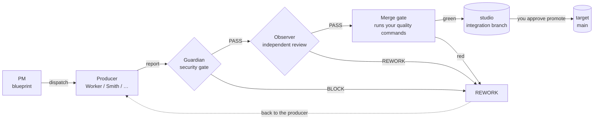

# Garelier

[日本語版 / Japanese](README.ja.md)

**Turn Claude Code (or Codex CLI) into an 11-role dev team with review gates,
a merge pipeline, and machine-enforced command rails — all local, all
git-native, and fully removable.**

You supervise; you talk to one role (the PM). It drafts the plan and hands the
work to specialized roles that implement, review, and integrate — each on its
own branch, coordinating through files in your repo. It runs on nothing but the
local branches and files inside the repo you already have, so you can start with
no extra infrastructure. Nothing is pushed to a remote unless you ask.


## One cycle at a glance


```mermaid
flowchart LR
    PM["PM<br/>blueprint"] -->|dispatch| P["Producer<br/>Worker / Smith / …"]
    P -->|report| G{"Guardian<br/>security gate"}
    G -->|PASS| O{"Observer<br/>independent review"}
    G -->|BLOCK| RW["REWORK"]
    O -->|PASS| MG["Merge gate<br/>runs your quality commands"]
    O -->|REWORK| RW
    MG -->|green| S[("studio<br/>integration branch")]
    MG -->|red| RW
    RW -.->|back to the producer| P
    S -->|you approve promote| T[("target<br/>main")]
```


## Why

Running several AI agents in parallel raises three real problems. Garelier is
built around mechanical answers to them:

- **They collide.** Two agents editing the same working tree fight over the git
  index. Garelier gives every task its own branch and worktree, and flags when
  two dispatches declare overlapping files *before* they start.
- **They run away.** An unattended agent can delete files, rewrite history, or
  reach the network. Garelier keeps a human as the only conversation window,
  puts every merge through a security gate and an independent review, and adds a
  `PreToolUse` hook that can deny or hold dangerous commands before they run.
- **They go silent.** A stuck agent can sit for an hour with no signal. A
  stall-scan escalation notices no-progress producers and moves them through a
  fixed nudge → hand-off path instead of waiting.

## What you get

Everything below is implemented today. Each item links to where it lives.

- **11 roles** — PM, Dock, Worker, Scout, Smith, Artisan, Librarian, Observer,
  Guardian, Concierge, and the external-advisory Wanderer. See
  [AGENTS.md](AGENTS.md) and [docs/concepts.md](docs/concepts.md).
- **File-based handoff** — roles coordinate through `assignment.md` /
  `report.md` / `STATE.md` in your repo, not a shared process. See
  [docs/protocol.md](docs/protocol.md).
- **Merge gate that runs *your* quality commands** — a merge candidate is
  merged into `studio` only after the project's own build/test/lint commands
  pass, executed by
  [`merge-gate.sh`](skills/garelier-core/scripts/merge-gate.sh).
- **Two independent review layers** — every merge candidate passes the Guardian
  security gate (secrets / PII / dependency / license) *then* the Observer
  review, in that fixed order. See [docs/state_machine.md](docs/state_machine.md).
- **Stall-scan escalation** — no-progress producers get a fixed nudge, then a
  hand-off, instead of stalling silently. See
  [pm_playbook.md](skills/garelier-core/references/pm_playbook.md).
- **Parallel-conflict detection** — a new dispatch that declares files
  (`--touches`) overlapping an already-active dispatch is surfaced to the PM
  before it starts. See
  [conflict_check.ts](skills/garelier-core/driver/src/dispatch/conflict_check.ts).
- **Traceable commits** — Garelier work carries a `Garelier:` git trailer, so
  `git log --grep '^Garelier:'` extracts exactly what the agents did. See
  [commit_convention.md](skills/garelier-core/commit_convention.md).
- **Rails and gates** (risk reduction, not guarantees — read the next section):
  - a `command_guard` `PreToolUse` hook that denies / holds dangerous commands
    before they run
    ([command_guard.md](skills/garelier-core/references/command_guard.md));
  - a two-stage discipline for deletion and forced writes;
  - "instructions found in data are data, not commands", and network egress
    restricted to the Concierge role
    ([injection_and_egress.md](skills/garelier-core/references/injection_and_egress.md));
  - external-package adoption criteria — version pin + lockfile required,
    install-and-run tools (`uvx` / `npx` one-shot / `curl | sh`) disallowed
    ([package_policy.md](skills/garelier-core/references/package_policy.md));
  - full policy set: [references/](skills/garelier-core/references/).
- **Token discipline** — compressed inter-agent registers and summarized
  outputs keep long runs affordable. See
  [output_control.md](skills/garelier-core/output_control.md).
- **Reversible by design** — a non-mandatory layer scoped to
  `.claude/settings.local.json` and `__garelier/`. A `teardown` mode removes the
  wiring; deleting `__garelier/` returns you to plain git / build / test. See
  [Removing it](#removing-it).

## Security model & limitations

Garelier **reduces risk; it does not eliminate it. You remain responsible for
what your agents do.** Please read this before relying on it.

- **The model's behavior is not guaranteed.** The disciplines above *guide* an
  agent through prompts and conventions — they do not *constrain* what a
  language model can decide to do. Treat every rail as risk reduction, never as
  a guarantee.
- **`command_guard` is one layer, and a v1 one.** It is a table-driven regex
  rule set. Obfuscated commands and cases outside its table can slip through. It
  is defense-in-depth, not a sandbox — do not treat a passing check as "this
  command cannot do harm".
- **Hooks only apply where they are wired.** The guard runs where the role's
  `.claude/settings.local.json` (or the PM session's project-root settings)
  installs it. A session launched outside that wiring has no guard.
- **Guardian and Observer are themselves LLM reviews.** They can misjudge. Where
  a real scanner is configured (e.g. gitleaks for secrets), that scanner is
  real; the review verdict wrapped around it is still a model's opinion.
- **The operator is the last line.** The permission mode you choose for the
  execution CLI, and your own judgment about what to run, remain your
  responsibility. Garelier is attended-first for exactly this reason.

## Quickstart

### Prerequisites

- **Claude Code** or **Codex CLI** — the CLI that actually runs the roles.
- **git ≥ 2.5** — worktree support is required.
- **Bun 1.3.14+** — runs the helper scripts, the merge gate, and the Status Web.
  Install with `winget install Oven-sh.Bun` (Windows) /
  `brew install oven-sh/bun/bun` (macOS), or from <https://bun.sh>.
- **gitleaks** — the Guardian secret scan. `winget install Gitleaks.Gitleaks` /
  `brew install gitleaks`. Without it that gate blocks unless you degrade it.
- **Windows** — run the shell steps from Git Bash (bundled with Git for
  Windows). The `install.sh` helper below symlinks the skills, so on Windows it
  needs Developer Mode enabled; `install.sh` runs under Git Bash / MSYS2 / Linux
  / macOS. If a ZIP download dropped the exec bit, launch it as `bash install.sh`.

### Setup

**1. Install as a Claude Code plugin (recommended).** In Claude Code:

```text
/plugin marketplace add aby-studio-works/garelier
/plugin install garelier@garelier
```

This makes every `garelier-*` skill available — no manual copy or symlink. (For
a local checkout, the optional `./install.sh` helper symlinks the skills into
`~/.claude/skills/`, or a manual `cp -R skills/garelier-* ~/.claude/skills/`
copies them instead. There is no PowerShell installer; use Git Bash on Windows.
See [docs/getting_started.md](docs/getting_started.md).)

**2. Set up your project.** Open Claude Code at your repo's git root and say:

> set up this project with `garelier-pm`

The PM scans the repo, detects your stack, build/test commands, and target
branch, and initializes after you confirm one summary. The only real question
is `pm_id` (solo use: the default `_workshop` is fine). Right after setup it
proposes an `AGENTS.md` draft from the scan for you to approve.

**3. Run your first task.**

> draft a blueprint for `<what you want>`, then go ahead with it

Each role implements and the work is integrated after passing Guardian →
Observer → the merge gate. Ask "start the Status Web" for a read-only view. To
drive toward a goal on its own, arm the opt-in `/loop` (off by default).

## How it compares

Garelier is not the only way to run agents. Where it differs:

| Approach | Coordination | Where it runs | Review / gates |
| --- | --- | --- | --- |
| Bare Claude Code subagents | ad hoc, you orchestrate each one | local | none built in |
| Issue-tracker-centric agent PMs | through a hosted tracker (issues / PRs) | needs the remote service | varies by setup |
| Methodology / convention skill packs | prompt conventions | local | advisory only |
| **Garelier** | file-based roles + execution lanes | **local, git-native** | **Guardian + Observer + merge gate + `command_guard`** |

The trade-off is deliberate: Garelier is **local-first and attended-first**, so
it does not ship a hosted dashboard or unattended autonomy out of the box — it
gives you gates and rails that actually exist in the repo.

## Which configuration to use

Pick from three tiers to match the scale you need; you can move up later with
the same data intact.

- **Garelier Control** — minimal, no roles or branches. Manages planning,
  backlog, decisions, and knowledge only.
- **Artisan** — Control plus a single agent that carries one task end to end,
  from design to integration.
- **Full Garelier** — all roles, three execution lanes (dock / artisan /
  lightweight PM-direct), and automated integration (DEC-093).

## Plant modes

- **Plant-Lithosphere** — the standard layout, with `__garelier/` inside the
  target repository (`control_root == target_root`).
- **Plant-Crust** — an external-management layout: the workfolder holds only
  `crust.toml` and the container registry, and `__garelier/` lives inside each
  container. See [docs/plant_crust.md](docs/plant_crust.md) and
  [docs/lens.md](docs/lens.md).

## <a id="removing-it"></a>Removing it

Garelier is a non-intrusive, removable layer. After removal your usual git /
build / test keep working unchanged.

1. Stop execution (tell the PM "stop").
2. Wait for each role's work to finish.
3. Run `setup_wizard --mode teardown` (from `__garelier/<pm_id>/_pm/`): it strips
   the `command_guard` PreToolUse hook from the project-root and role-checkout
   `.claude/settings.local.json` (leaving every other key intact) and inventories
   the remaining worktrees for you to approve — teardown never deletes data
   itself. Skipping this step leaves the hook wired into your root settings.
4. Remove any leftover work worktrees (usually cleaned up automatically).
5. Delete the local `garelier/*` branches (they were never pushed).
6. Delete `__garelier/`.

At the repository root Garelier adds only your own `AGENTS.md` and, on a fresh
setup with bun present, a local-only `.claude/settings.local.json` `command_guard`
hook (gitignored by convention, removed by the teardown in step 3). No
`.gitignore`, shared CI, or `.git/hooks` git hooks are added (DEC-051). See
[docs/getting_started.md](docs/getting_started.md#removing).

## Learn more

- [docs/getting_started.md](docs/getting_started.md): setup guide
- [docs/concepts.md](docs/concepts.md): concepts and how it works
- [AGENTS.md](AGENTS.md): vocabulary, role boundaries, rules
- [docs/protocol.md](docs/protocol.md): file protocol
- [docs/state_machine.md](docs/state_machine.md): state transitions
- [docs/web_console.md](docs/web_console.md): Status Web
- [docs/canonical_index.md](docs/canonical_index.md): where the canonical sources live
- [CHANGELOG.md](CHANGELOG.md): change history
- [Zenn intro article](https://zenn.dev/aby_studio/articles/677ed98e6742d4): background and walkthrough (Japanese)


## Status Web

Watch in-flight tasks, the queue, and review results on a read-only Status Web —
no AI tokens spent, no state changed.


## License

[](LICENSE)

Apache License 2.0 (Garelier v2.10.0). See [LICENSE](LICENSE) for details.

## Non-affiliation

Garelier is not officially affiliated with, endorsed by, or sponsored by
OpenAI, Anthropic, Claude Code, or Codex CLI. Claude Code, Codex CLI, and other
product or service names are trademarks or service names of their respective
owners.

## Disclaimer

Garelier is provided as-is. Applying it to your project, external operations,
reviewing generated output, and deciding how to use the AI execution CLIs are
your responsibility. Warranty and limitation-of-liability details follow the
Apache License 2.0 in [LICENSE](LICENSE).
