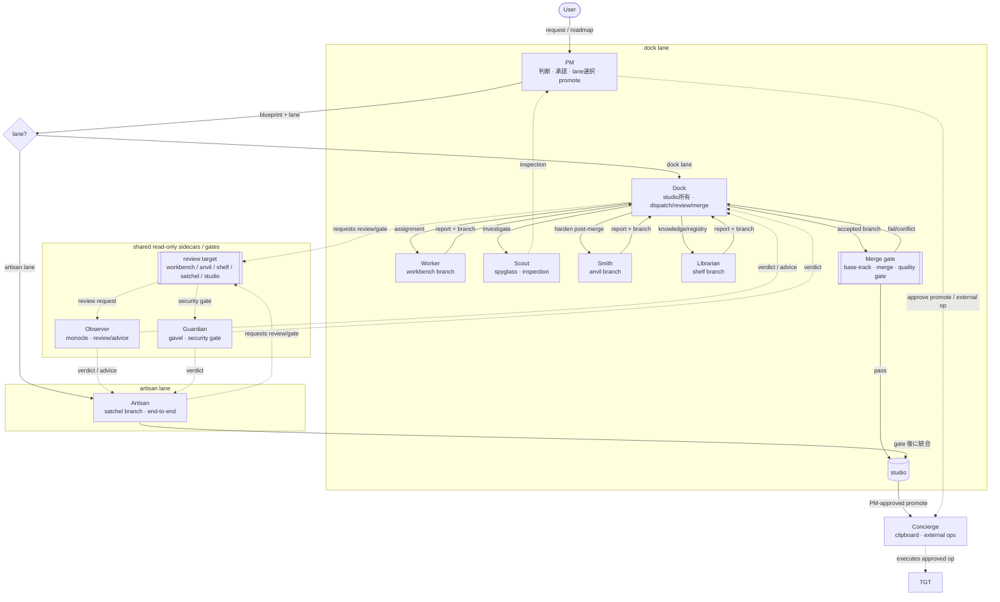

# How work flows (command chain & pipeline)

Garelier で request が merged work になるまでの静的な説明です。command
chain、排他の 2 lane、role、branch、read-only sidecar / gate の位置関係を
示します。実際の live queue と execution board は **Work** で見ます。この
ページは各部品の意味を確認するためのものです。`mermaid` を vendored して
いれば図として描画され、なければ source text のまま読めます。

## The chain of command

## The two lanes (mutually exclusive)

同時に走る lane は 1 つだけです。`runtime/lane.lock` が dock lane と
artisan lane の排他を管理します。

- **Dock lane** は通常の協調経路です。PM が blueprint を作り、
  **Dock** が `studio` を所有して dispatch、report review、accepted
  producer branch の **merge gate** 送信を行います。Worker / Smith /
  Librarian は commit を作り、Scout は inspection を作ります。Observer と
  Guardian は review target に対して request される read-only sidecar/gate
  で、merge も `lane.lock` 取得もしません。
- **Artisan lane** は **Artisan** が Dock+Worker+Scout+Smith+Librarian 相当
  を `satchel` branch 上で単独実行し、quality gate、Guardian、Observer の
  後に `studio` へ統合します。その後の promote は PM が承認し Concierge が
  実行します。producer gate の requester は Dock ではなく Artisan です。

## Queue order

Live Work board は **roadmap -> active/unblocked milestones -> backlog
items -> phases** の階層で読みます。open かつ前提条件が解消済みの
milestone に属する backlog item は dispatch 対象として `ACTIVE QUEUE` に
出ます。安全に並列化できる場合は複数 milestone がここに並びます。後続または
依存関係で保留中の milestone item は `FUTURE QUEUE` に表示しますが、
milestone/dependency gate が開くまでは意図的に dispatch 保留です。これにより、
role capacity が空いていても held future milestone work しか無い状況を
「詰まり」ではなく gate として読めます。

## Roles, by "commit vs report"

| Role | Produces | Branch | Notes |
| --- | --- | --- | --- |
| **PM** | decisions | (none) | source は編集しない。lane 選択、promote/external op 承認を行う。 |
| **Dock** | merges only | owns `studio` | Dispatch / review / merge-gate。base-tracking conflict は例外的に解決する。 |
| **Worker** | commits | `workbench/#id` | 実装。Dock review + merge gate に戻る。 |
| **Scout** | a report (inspection) | `spyglass` (ephemeral) | commit-free investigation。accepted inspection は PM が commit する。 |
| **Smith** | commits | `anvil/#id` | integration / license / security などの post-merge hardening。 |
| **Librarian** | commits | `shelf/#id` | 外部情報同期、内部 policy/runbook/registry 更新。 |
| **Observer** | a verdict/advice | `monocle` (ephemeral) | read-only sidecar。requester は Dock / Artisan / Worker。 |
| **Guardian** | a verdict | `gavel` (ephemeral) | read-only security/privacy/dependency/license gate。requester は Dock / PM / Artisan。 |
| **Concierge** | external op | `clipboard` (local) | PM-approved external operation、promote merge / tag / push などを実行する。 |
| **Artisan** | commits | `satchel/#id` | single-agent lane。gate 後に `studio` へ統合する。 |

## The merge gate

Dock が producer branch を統合するとき、base-track、merge、configured
quality gate の実行は **async subprocess** で行われます。Dock は request
を dispatch し、後で result を verify します。その間も他 producer は進めます。
`pass` なら branch は `studio` に入り、`fail` / `conflict` なら Dock に
戻ります。

Artisan lane は自身の quality gate、Guardian、Observer の後に `studio` へ
統合します。両 lane とも `studio` から `target` への promote は PM 承認 +
Concierge 実行です。

## Base tracking (keeping current with target)

`studio` は **merge** で `target` に追従します。rebase は使いません。detached
worktree が履歴を参照しているためです。tracking は Dock が新しい worktree
を切る前、branch を `studio` に merge する前、PM が promote を承認して
Concierge に dispatch する前に行います。

**Forward-integration (`studio` -> in-flight `workbench` / `anvil`), DEC-039.**
通常の base tracking は片方向なので、長く走る Worker/Smith は `studio` tip
からずれる可能性があります。Dock はずれを検出し、idempotent な
`track-target.md` trigger を置きます。producer は次の iteration 境界で
`studio` を merge し、conflict は自分で解決します。Dock は trigger と
verify のみを行います。

## Branch namespace

Garelier branch は `garelier/<target-slug>/<pm_id>/...` 配下に置かれ、
既定では **local-only** です。`<target-slug>` は `/` を `-` に置き換えたもの
です。例: `target = develop/soft` -> `develop-soft`。
