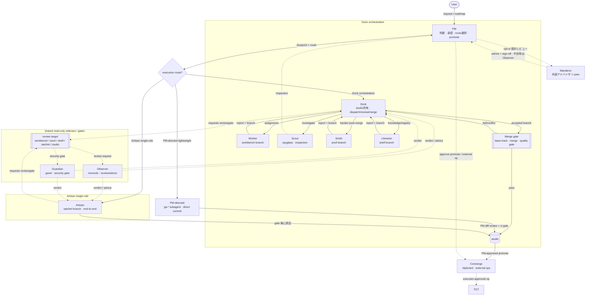

# How work flows (command chain & pipeline)

Garelier で request が merged work になるまでの静的な説明です。command
chain、execution route、role、branch、read-only sidecar / gate の位置関係を
示します。実際の live queue と execution board は **Work** で見ます。この
ページは各部品の意味を確認するためのものです。

## The chain of command

```mermaid
flowchart TD
  User([User]) -->|request / roadmap| PM
  PM[PM\n判断 · 承認 · route選択 · promote] -->|blueprint + route| ROUTE{execution route?}
  PM -.opt-in 設計レビュー.-> WD[Wanderer\n外部アドバイザリ peer]
  WD -.advice + sign-off · 不在時は Observer.-> PM

  subgraph OL[Dock orchestration]
    DOCK[Dock\nstudio所有 · dispatch/review/merge]
    W[Worker\nworkbench branch]
    SC[Scout\nspyglass · inspection]
    SM[Smith\nanvil branch]
    LB[Librarian\nshelf branch]
    MG[[Merge gate\nbase-track · merge · quality gate]]
    STU[(studio)]

    DOCK -->|assignment| W
    DOCK -->|investigate| SC
    DOCK -->|harden post-merge| SM
    DOCK -->|knowledge/registry| LB
    W -->|report + branch| DOCK
    SM -->|report + branch| DOCK
    LB -->|report + branch| DOCK
    SC -.inspection.-> PM
    DOCK -->|accepted branch| MG
    MG -->|pass| STU
    MG -->|fail/conflict| DOCK
  end

  subgraph SL[Artisan single-role]
    ART[Artisan\nsatchel branch · end-to-end]
  end

  subgraph SG[shared read-only sidecars / gates]
    RT[[review target\nworkbench / anvil / shelf / satchel / studio]]
    OB[Observer\nmonocle · review/advice]
    GU[Guardian\ngavel · security gate]
    RT -.review request.-> OB
    RT -.security gate.-> GU
  end

  ROUTE -->|Dock orchestration| DOCK
  ROUTE -->|Artisan single-role| ART
  ROUTE -->|PM-directed lightweight| PMD[PM-directed\nga-* subagent · direct commit]
  PMD -->|PM diff review + ci gate| STU

  DOCK -.requests review/gate.-> RT
  ART -.requests review/gate.-> RT
  OB -.verdict / advice.-> DOCK
  OB -.verdict / advice.-> ART
  GU -.verdict.-> DOCK
  GU -.verdict.-> ART

  ART -->|gate 後に統合| STU
  STU -->|PM-approved promote| CN
  PM -.approve promote / external op.-> CN[Concierge\nclipboard · external ops]
  CN -.executes approved op.-> TGT
```

## Execution routes

PMがタスクごとにexecution routeを選び、固定/default routeはありません。role
routeは並行可能ですが、`studio`へ書くintegratorは同時に1つだけです。この不変則は
共有merge-gate critical section `runtime/merge_gate/locks/active.lock` が守ります。

- **Dock orchestration** は通常の協調経路です。PM が blueprint を作り、
  **Dock** が `studio` を所有して dispatch、report review、accepted
  role branch の **merge gate** 送信を行います。Worker / Smith /
  Librarian は commit を作り、Scout は inspection を作ります。Observer と
  Guardian は review target に対して request される read-only sidecar/gate
  で、mergeを行いません。
- **Artisan single-role** は **Artisan** が Dock+Worker+Scout+Smith+Librarian 相当
  を `satchel` branch 上で単独実行し、quality gate、Guardian、Observer の
  後に `studio` へ統合します。その後の promote は PM が承認し Concierge が
  実行します。role gate の requester は Dock ではなく Artisan です。その
  儀式(singleton、satchel branch、Guardian → Observer、merge request)は
  *`studio` 統合* の要件です。expected studio SHAがstaleならforward-integrateし、
  required gateを再実行します。
- **PM-directed lightweight**(DEC-093)は、canonical simulation や重い workspace に
  触れない control / docs / tooling / script 級の変更で、高速で決定的な repo
  検証正本(ci.ts 級の gate)が存在し、blast radius が単一 repo のときの軽量
  経路です。PM が `ga-<step>-<slug>` subagent を直接監督し、integration branch
  へ commit させます。canonical 検証が完了条件、PM diff review が merge 相当の
  統合レビューです(Guardian/Observer の gate verdict ではありません — DEC-090)。
  Guardian / Observer は risk class(secrets / auth / crypto、依存追加、license、
  protected path)に触れるときだけ dispatch します。integration branch へ書く
  role は同時 1(並列は isolate branch で行う)。基準充足に迷うときは重い
  Dock orchestration に倒します — この route は gate を飛ばす抜け道ではありません。

## PM design review (before build)

*非自明な* PM 設計(blueprint や project spec のうち、大きな diff・新しい
top-level key・protected-path / architecture / policy 変更にあたるもの)は、
確定する前に **独立レビュー＋相互サインオフ** を通します — role が実装に
入る前に早期に捕まえます。主レビュアーは **Wanderer**(任意・opt-in の
**外部アドバイザリ peer**):別途起動した Codex / Claude Code セッション(多くは
別の強力な model)で、file ベースの **peer-channel**(`runtime/peer/<channel>/`)
越しに設計を読み、verdict と助言を返します。execution route も branch も持たず、commit せず、
何も決定しません — サインオフは PM と user が所有します。Wanderer が不在・timeout
経過で沈黙・rate-limited の場合、PM は **Observer** subagent(常時利用可能な floor)
にフォールバックします。`auto_approve_blueprints` は非自明な設計でこの gate を
バイパスしません。小さな blueprint はスキップします。

## Queue order

Live Work board は **roadmap -> active/unblocked milestones -> backlog
items -> phases** の階層で読みます。open かつ前提条件が解消済みの
milestone に属する backlog item は dispatch 対象として `ACTIVE QUEUE` に
出ます。安全に並列化できる場合は複数 milestone がここに並びます。後続または
依存関係で保留中の milestone item は `FUTURE QUEUE` に表示しますが、
milestone/dependency gate が開くまでは意図的に dispatch 保留です。これにより、
role capacity が空いていても held future milestone work しか無い状況を
「詰まり」ではなく gate として読めます。

## Roles, by "commit vs report"

| Role | Produces | Branch | Notes |
| --- | --- | --- | --- |
| **PM** | decisions | (none) | source は編集しない。execution route 選択、promote/external op 承認を行う。 |
| **Dock** | merges only | owns `studio` | Dispatch / review / merge-gate。base-tracking conflict は例外的に解決する。 |
| **Worker** | commits | `workbench/#id` | 実装。Dock review + merge gate に戻る。 |
| **Scout** | a report (inspection) | `spyglass` (ephemeral) | commit-free investigation。accepted inspection は PM が commit する。 |
| **Smith** | commits | `anvil/#id` | integration / license / security などの post-merge hardening。 |
| **Librarian** | commits | `shelf/#id` | 外部情報同期、内部 policy/runbook/registry 更新。 |
| **Observer** | a verdict/advice | `monocle` (ephemeral) | read-only sidecar。requester は Dock / Artisan / Worker。 |
| **Guardian** | a verdict | `gavel` (ephemeral) | read-only security/privacy/dependency/license gate。requester は Dock / PM / Artisan。 |
| **Concierge** | external op | `clipboard` (local) | PM-approved external operation、promote merge / tag / push などを実行する。 |
| **Artisan** | commits | `satchel/#id` | Artisan route。gate 後に `studio` へ統合する。 |
| **Wanderer** | 助言 + sign-off | (なし — 外部) | アドバイザリ・レビュー役: 確定前の PM 設計を peer-channel 越しにレビューする外部の opt-in peer。commit 無・決定なし。不在時は Observer。上の *PM design review* を参照。 |

## The merge gate

Dock が role branch を統合するとき、base-track、merge、configured
quality gate の実行は **async subprocess** で行われます。Dock は request
を dispatch し、後で result を verify します。その間も他 role は進めます。
`pass` なら branch は `studio` に入り、`fail` / `conflict` なら Dock に
戻ります。

Artisan route は自身の quality gate、Guardian、Observer の後に `studio` へ
統合します。両 execution route とも `studio` から `target` への promote は PM 承認 +
Concierge 実行です。

## Base tracking (keeping current with target)

`studio` は **merge** で `target` に追従します。rebase は使いません。detached
worktree が履歴を参照しているためです。tracking は Dock が新しい worktree
を切る前、branch を `studio` に merge する前、PM が promote を承認して
Concierge に dispatch する前に行います。

**Forward-integration (`studio` -> in-flight `workbench` / `anvil`).**
通常の base tracking は片方向なので、長く走る Worker/Smith は `studio` tip
からずれる可能性があります。Dock はずれを検出し、idempotent な
`track-target.md` trigger を置きます。role は次の iteration 境界で
`studio` を merge し、conflict は自分で解決します。Dock は trigger と
verify のみを行います。

## Branch namespace

Garelier branch は `garelier/<target-slug>/<pm_id>/...` 配下に置かれ、
既定では **local-only** です。`<target-slug>` は `/` を `-` に置き換えたもの
です。例: `target = develop/soft` -> `develop-soft`。
