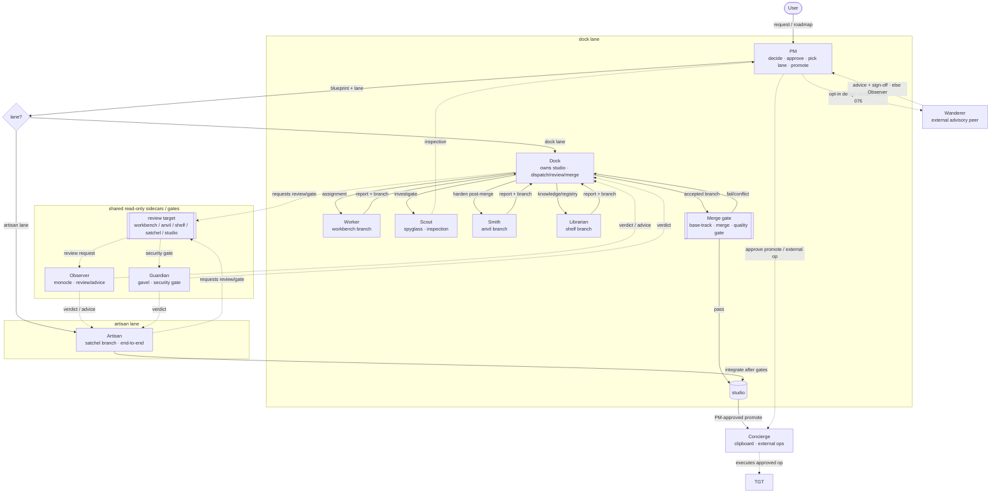

# How work flows (command chain & pipeline)

A **static** explanation of how a request becomes merged work in Garelier:
the command chain, the two mutually exclusive lanes, the roles, the branches,
and the read-only sidecars / gates. The console's **Work** page shows the live
queue and execution board; this page explains what the moving parts mean.
(Diagrams render if `mermaid` is vendored; otherwise the source stays readable.)

## The chain of command

## The two lanes (mutually exclusive)

Only one lane runs at a time. `runtime/lane.lock` arbitrates the choice between
the dock lane and the artisan lane.

- **Dock lane** — the normal, coordinated path. PM authors a blueprint and
  hands it to **Dock**, which owns `studio`, dispatches work, reviews
  reports, and sends accepted producer branches through the **merge gate**.
  Worker / Smith / Librarian produce commits. Scout produces an inspection.
  Observer and Guardian are read-only sidecars/gates requested against a review
  target; they never merge and never hold `lane.lock`.
- **Artisan lane** — one **Artisan** performs the combined
  Dock+Worker+Scout+Smith+Librarian scope on a `satchel` branch and integrates it
  into `studio` after its own quality gate and required Guardian -> Observer
  checks. PM then approves any promote and Concierge executes it. The requester
  for producer gates is the Artisan, not Dock.

## PM design review (before build, DEC-076)

Before a *non-trivial* PM design (a blueprint or project spec that is a large
diff, a new top-level key, or a protected-path / architecture / policy change) is
finalized, it must pass an **independent review with mutual sign-off** — caught
early, before any producer builds against it. The primary reviewer is the
**Wanderer**, an optional, opt-in **external advisory peer**: a separately-launched
Codex / Claude Code session (often a different, strong model) that reads the
design over the file-based **peer-channel** (`runtime/peer/<channel>/`) and replies
with a verdict and advice. It takes no lane or branch, makes no commits, and
decides nothing — PM and user own the sign-off. When the Wanderer is absent,
silent past a timeout, or rate-limited, the PM falls back to the **Observer**
subagent (the always-available floor). `auto_approve_blueprints` does not bypass
this gate for a non-trivial design; small blueprints skip it.

## Queue order

The live Work board follows the planning hierarchy: **roadmap ->
active/unblocked milestones -> backlog items -> phases**. Backlog items from
open, prerequisite-clear milestones are dispatchable and appear in
`ACTIVE QUEUE`; this can include multiple milestones when they are safe to run
in parallel. Items for later or dependency-held milestones stay visible in
`FUTURE QUEUE`, but they are intentionally held until the milestone/dependency
gate opens. This makes an empty-looking capacity situation readable: a role can
be available while only held future milestone work is queued.

## Roles, by "commit vs report"

| Role | Produces | Branch | Notes |
| --- | --- | --- | --- |
| **PM** | decisions | (none) | Never edits source; selects lane; approves promote/external ops. |
| **Dock** | merges only | owns `studio` | Dispatch / review / merge-gate; resolves base-tracking conflicts. |
| **Worker** | commits | `workbench/#id` | Implementation; returns to Dock review + merge gate. |
| **Scout** | a report (inspection) | `spyglass` (ephemeral) | Commit-free investigation; PM commits accepted inspections. |
| **Smith** | commits | `anvil/#id` | Post-merge hardening such as integration, license, and security follow-up. |
| **Librarian** | commits | `shelf/#id` | External-info sync + internal policy/runbook/registry updates. |
| **Observer** | a verdict/advice | `monocle` (ephemeral) | Read-only sidecar. Requester can be Dock, Artisan, or Worker. |
| **Guardian** | a verdict | `gavel` (ephemeral) | Read-only security/privacy/dependency/license gate. Requester can be Dock, PM, or Artisan. |
| **Concierge** | external op | `clipboard` (local) | Executes PM-approved external operations such as promote merge, tag, or push. |
| **Artisan** | commits | `satchel/#id` | Single-agent lane; integrates into `studio` after its gates. |
| **Wanderer** | advice + sign-off | (none — external) | The advisory-review role (DEC-076): an external, opt-in peer reviewing PM design before build over the peer-channel; commit-free, no decision; Observer is the fallback. See *PM design review* above. |

## The merge gate

When Dock integrates a producer branch, the mechanical part (base-track,
merge, run configured quality gates) runs as an **async subprocess**. Dock
dispatches the request and later verifies the result, so other producers can
continue while a merge is in flight. A result is `pass` -> the branch lands on
`studio`; `fail` / `conflict` -> it returns to Dock.

The Artisan performs its own quality gate, then Guardian and Observer, before
integrating into `studio`. Both lanes use the same PM approval + Concierge
promote path from `studio` to `target`.

## Base tracking (keeping current with target)

`studio` is kept current with `target` by **merge** (never rebase, because
detached worktrees reference that history). Tracking runs before Dock cuts
a new worktree, before it merges a branch into `studio`, and before PM
dispatches Concierge for a promote.

**Forward-integration (`studio` -> in-flight `workbench` / `anvil`), DEC-039.**
Base tracking above is one-directional, so a long-running Worker/Smith can drift
from the `studio` tip. Dock checks for that drift and drops an idempotent
`track-target.md` trigger; the producer merges `studio` at its next iteration
boundary and resolves conflicts itself. Dock only triggers and verifies.

## Branch namespace

All Garelier branches live under `garelier/<target-slug>/<pm_id>/...` and are
**local-only** by default. `<target-slug>` replaces `/` with `-` so branch depth
stays constant, for example `target = develop/soft` -> `develop-soft`.
