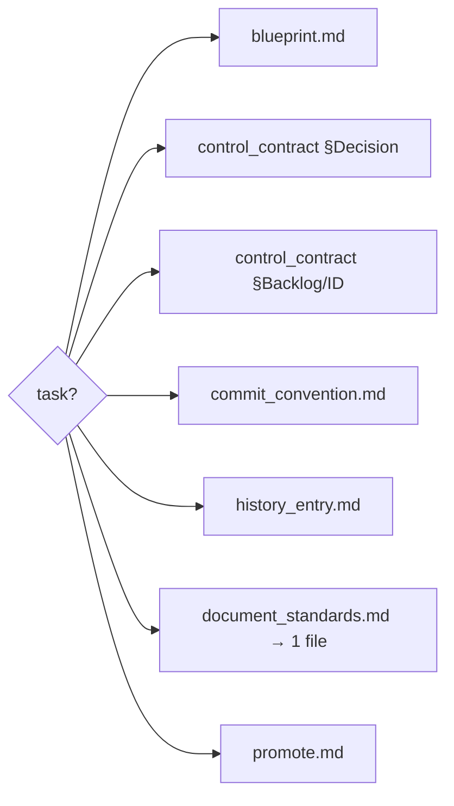

# Navigation — task → minimal read set (DEC-051)

Token-efficient routing for the PM and Garelier-Control skills: for a given task,
read **only** the files listed — do not scan whole trees or load large docs to
"find" the rule. Paths are canonical (see `docs/canonical_index.md`). Roles also
have a by-role prerequisite set in `docs/garelier/knowledge/role_index.toml`
(`read_first` / `on_demand`); this table is the finer task axis on top of it.

| Task | Read only (in order) |
| --- | --- |
| Author / revise a blueprint | `skills/garelier-pm/templates/blueprint.md`; the linked `control/milestones/<slug>.md` |
| Record a decision (ADR) | `control_contract.md` §Decision; `control_scaffold/templates/decision.md`; append to `project_dashboard/decisions.md` |
| Add/triage backlog or risk | `control_contract.md` §Backlog / §Other dashboard / §ID numbering |
| Edit roadmap / milestones | `control_contract.md` §Other dashboard; `control_scaffold/templates/milestone.md` |
| Write a commit message | `commit_convention.md` |
| Append a PM history entry | `skills/garelier-pm/templates/history_entry.md` (fixed schema) |
| "Which format does X use?" | `document_standards.md` (index → the one authoritative file for X) |
| Promote studio → target | `skills/garelier-pm/templates/promote.md`; `control_scaffold/operations/promote_checklist.md` |
| Knowledge: add/sync a doc | `knowledge_contract.md`; `skills/garelier-librarian/templates/knowledge_document.md` |
| Set up / repair control tree | `control_contract.md`; `skills/garelier-control-project/SKILL.md` |
| Mutates external data? | `control_scaffold/operations/data_change_policy.md` + blueprint §Data-change guards |

Rule: if the task is not listed, open `document_standards.md` (the index) first to
find the single authoritative file, then read that file — never read the whole
`skills/` or `control/` tree to locate a format. Standards are enforced as a
non-mandatory layer (DEC-051): they guide Garelier-driven work and are opt-in for
humans; they never block a non-Garelier contributor.
