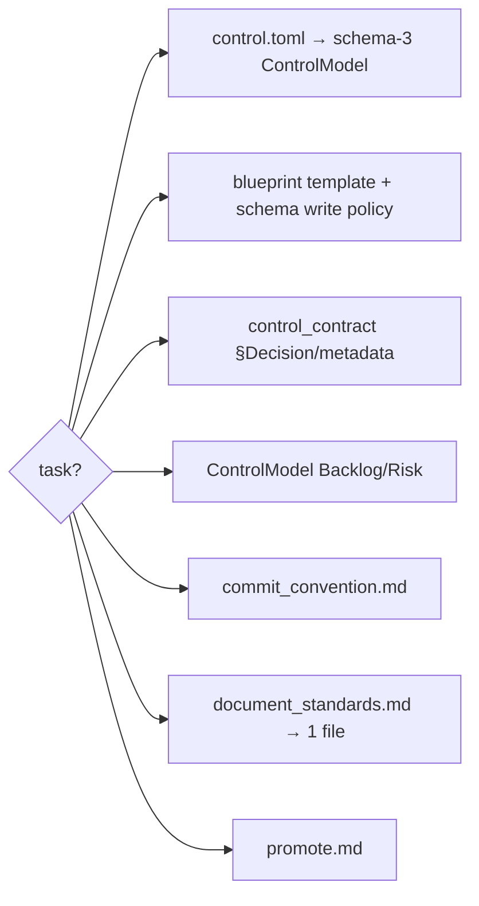

# Navigation — task → minimal read set (DEC-051)

Token-efficient routing for the PM and Garelier-Control skills: for a given task,
read **only** the files listed — do not scan whole trees or load large docs to
"find" the rule. Paths are canonical (see `docs/canonical_index.md`). Roles also
have a by-role prerequisite set in the `role_index.toml` knowledge index
(`read_first` / `on_demand`); this table is the finer task axis on top of it.

| Task | Read only (in order) |
| --- | --- |
| Start/resume AI control work | `control.toml`; schema 3: `control session-open/resume` → Current + ordered Checkpoints + referenced Backlogs |
| Author / revise a blueprint | primary Checkpoint/Backlog from `control get` + schema-3 blueprint template |
| Record a decision (ADR) | schema router contract → selected schema contract + decision template; v3 direct authoring must pass strict validation |
| Add/triage Backlog or Risk | `control get/list`, schema-3 Backlog/Risk template, lifecycle command where transactional |
| Edit Current / Checkpoints / Roadmaps / Milestones | schema-3 bounded graph + relevant templates; activation/archive/relation-retire via lifecycle transaction |
| Write a commit message | `commit_convention.md` |
| "Which format does X use?" | `document_standards.md` (index → the one authoritative file for X) |
| Promote studio → target | `skills/garelier-pm/templates/promote.md`; target namespace `control/operations/promote_checklist.md` |
| Knowledge: add/sync a doc | `knowledge_contract.md`; `skills/garelier-librarian/templates/knowledge_document.md` |
| Set up / repair control tree | `control_contract.md` router; selected schema contract; create with `garelier setup` (the sole initializer); operate per `skills/garelier-pm/references/control-management.md`; repair through reviewed `control repair --plan/apply` |
| Mutates external data? | target namespace `control/operations/data_change_policy.md` + blueprint §Data-change guards |

```mermaid
flowchart LR
  T{task?} --> R[control.toml → schema-3 ControlModel]
  T --> BP[blueprint template + schema write policy]
  T --> DEC[control_contract §Decision/metadata]
  T --> BL[ControlModel Backlog/Risk]
  T --> C[commit_convention.md]
  T --> X[document_standards.md → 1 file]
  T --> P[promote.md]
```

Rule: if the task is not listed, open `document_standards.md` (the index) first to
find the single authoritative file, then read that file — never read the whole
`skills/` or `control/` tree to locate a format. Standards are enforced as a
non-mandatory layer (DEC-051): they guide Garelier-driven work and are opt-in for
humans; they never block a non-Garelier contributor.
